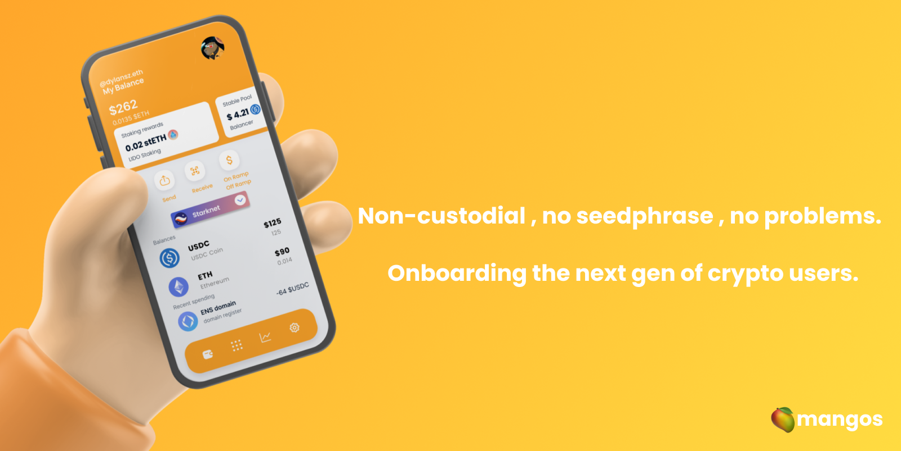

import Bleed from 'nextra-theme-docs/bleed'

# Introduction

Mangos is a multichain (evm-compatible) self-custodial wallet that allows users to forgo the need of storing seedphrases, to recover access to their account in case the device is lost or compermised and pay their tx's with ERC-20 tokens.

<Bleed></Bleed>
