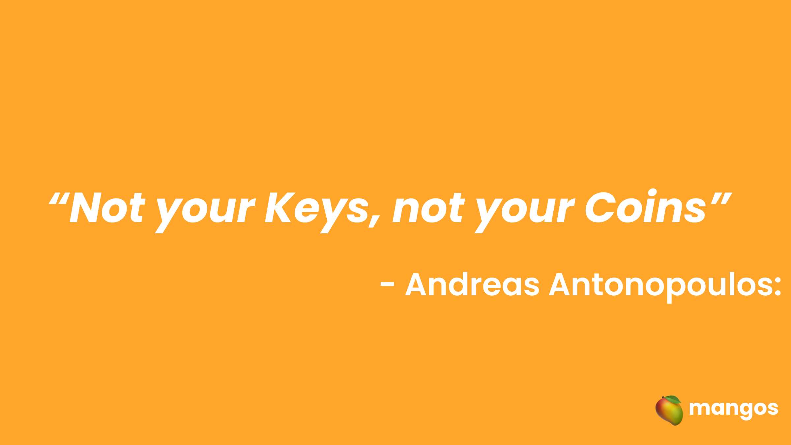
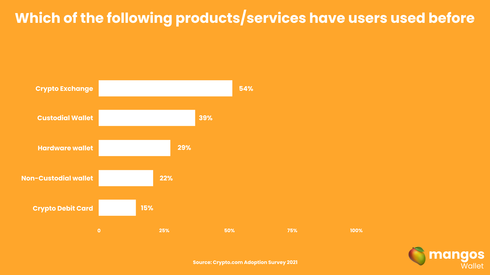

# The problem

## Preface

"Crypto" and blockchain as a whole have evolved exponecially over the last couple of years in terms of technical achivements, although there are short comings in the adoption process. This can be summed up as having an **onboarding** problem that can be seen as a key managment problem.

## Key management

Private keys are vital for the functioning of a blockchain, as it allows to sign transaction and more or less are also the key to identity and ownership inside this system. And although things like seed phrases allow for an easier way of storing and safe guarding your are asset the problem still lingers.

Loosing any of the two without proper backup means that your assets are completly lost. We can't think about adoption by the general public if they can loose all of their money or identity by just simple human error.

Some facts abot forgetting your keys:

- About 25% of all existing BTC has been lost forever due to loss of private keys.
- The average person forgets their home banking password once every 6 weeks.

## The Trojan horse of Custodial wallets

During the last couple of years a lot of applications that offered cryptocurrency services have become very popular. Some of them could be labeled as "Fintechs". They allow users to buy/sell and store their coins in one place but with the caveat of them having control over the private keys and money of their users. And exposing their users privacy and data. Or even risking the users funds in case their business becomes insolvent
One could say that this defeats the whole purpose of the technology where ownership, privacy and trustlessness plays a vital part of the experience.

import Bleed from 'nextra-theme-docs/bleed'

<Bleed></Bleed>

## What is witholding Non-Custodial wallets behing?

With all of that said, what's hodling the adoption of non-custodial wallets?

<Bleed></Bleed>
We can see that non-custodial solution only take 27% of the total crypto users. And
as it's been said the clear problem when opting for non-custodial solutions is key
managment, that at the same time derives into UX, on-ramping and more problems that
need solutions that take into account into this need paradigms. Although not everything
is bad news, advances in network development is making easier for users to opt-in
directly for non-custodial solution since it's previous side effects like high tx's
fees, speed and high catalogue of dapps

So how do we solve this adoption problem?
