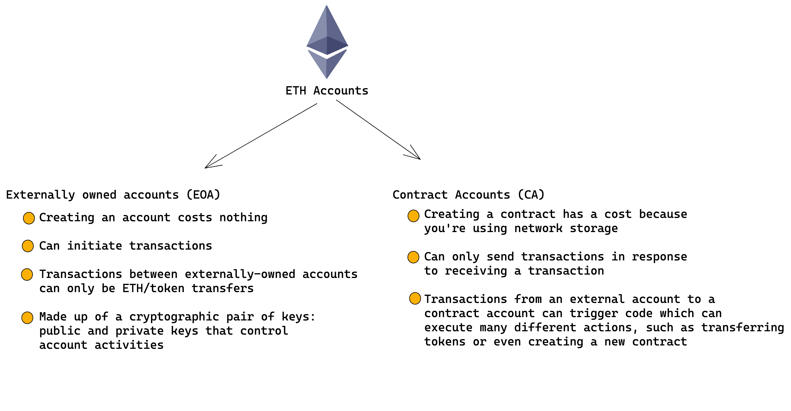
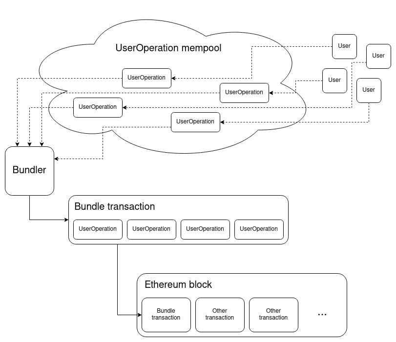
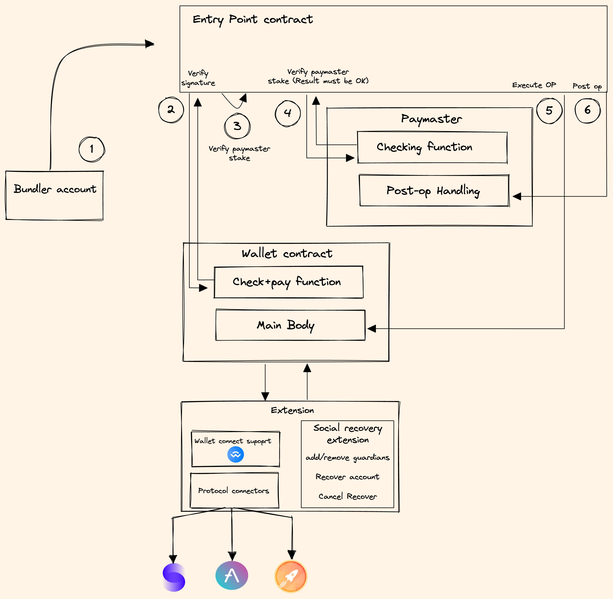

# Account Abstraction

## TL;DR

Account abstraction allows to use and interact with smart contracts without the need of EOA (externally own accounts). It permit smart contracts to define what is a valid transaction via a set of specific method and interfaces with their own logic.

## Etehereum Accounts

To understand better the types of ethereum accounts and their characteristics.

import Bleed from 'nextra-theme-docs/bleed'

<Bleed></Bleed>
With this highlighted we can see the limitations that the current state of affairs
pose to the adoption of crypto and specially smart contract wallets. Up to now all
interactions on chain had to be iniciated with a the help of a EOA that had to be
funded with ETH to pay for the gas fees, interact with contracts (even contract wallets)
and sign transactions.{' '}

## ERC-2771 Meta Transactions footnote

Although we can argument that the need for the account to be funded can be mitigated by implementation of a relayer aka (meta transaction ERC-2771 [on it self doesn't solve the whole problem but it is still an useful tool]) that doesn't eliminate the need of a EOA to originally sign the transaction.

<Bleed>
  
</Bleed>

## Account abstraction

The main idea with account abstraction is to decouple the relation between the signer and the account.
With account abstraction every account is a smart contract that has it's own logic. For example. allowing for different signatures schemes, different ECDSA, native multi-signature support and more.

### How does it work

For this to work without changes to the consensus layer, it necesary to implement an "alternative" mempool in a higher level system. Where users send `UserOperation` object that packages up the users intents along with signatures and other data for verification. Then bundlers or miners can package up a set of `UserOperation` into a single Bundle transaction that gets into an EThereum Block.

<Bleed></Bleed>

The bundler pays the fee for the bundle transaction in ETH, and gets compensated through fees paid as part of all teh individual `UserOperation` executions. Bundlers would choose which `UserOperation` objects to include based upn a fee-priorization logic to how miners operate in the eisting transaction mempool. A `UserOperation` is composed similar to a transaction; it's an ABi encoded struct that has the following fields

- `Sender`: The wallet making the operation
- `Nonce` and `Signature`: Parameters passed into the wallet's verification function so the wallet can verify the operation.
- `initCode`: The limit code to create the wallet if it doesn't exist yet.
- `callData`: what data to call the wallet with for the actual execution step.

We can define that a contract wallet is required to have two functions:

- `validateUserOp`, which takes an `UserOperation` as input. This function is supposed to verify the signature and nonce on the UserOperation, pay the fee and increment the nonce if verification succeeds, and throw an exception if verification fails.

- An op execution function, that interprets calldata as an instruction for the wallet to take actions. How this function interprets the calldata and what it does as a result is completely open-ended; but we expect most common behavior would be to parse the calldata as an instruction for the wallet to make one or more calls.

<Bleed></Bleed>

### Paymaster gas sponsorship

The inclusion of a paymaster to sponsor the users transaction is a highly useful addition because it allows for app to pay on behalf of the user and second because it allows users to pay their transaction fees using ERC-20 via a proxy contract that collects the ERC-20 and pays in ETH. This is huge in terms of adoption because it allows for the use of smart contract wallets without the need of ETH and of great utility in markets where stables are widely use like Latin America.

### sources for further reading:

- [Ethereum Magicians threads](https://ethereum-magicians.org/t/erc-4337-account-abstraction/6151)
- [EIP 4337 proposal page](https://eips.ethereum.org/EIPS/eip-4337)
- [Dror Tirosh and Yoav Weiss Account abstraction Presentation](https://docs.google.com/presentation/d/1MN9V8mVTL3eIJfxqVCoOgc7UZje38ELijjOX5TZqJT0/edit#slide=id.gff5cf94f7d_0_492)
- [Vitalik's Medium Post on ERC-4337](https://medium.com/infinitism/erc-4337-account-abstraction-without-ethereum-protocol-changes-d75c9d94dc4a)
