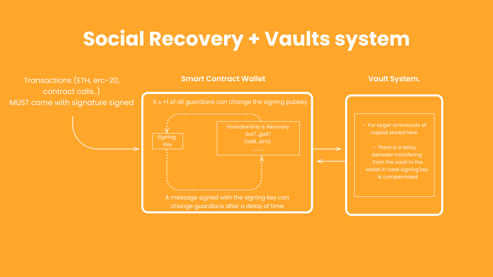
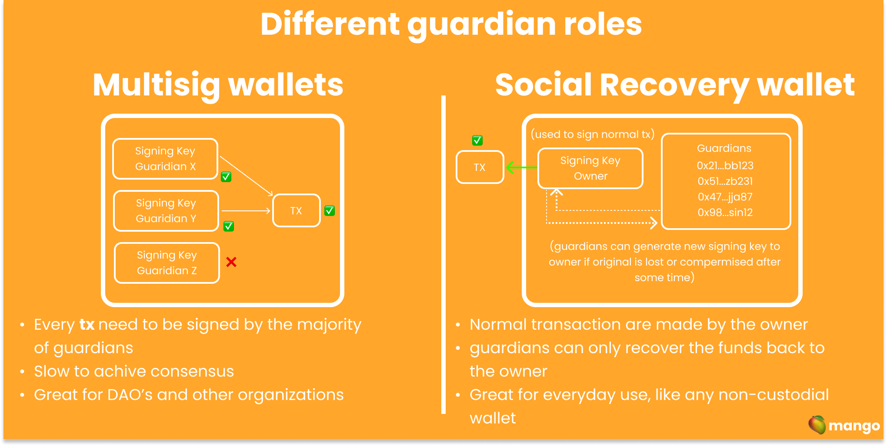

# Social Recovery

Social Recovery is a way for users to restore and recover access to their funds in case they loose access to them by any sort of reasons. This is done by selecting a series of guardians who can grant access back to the user when requested.

import Bleed from 'nextra-theme-docs/bleed'

## How does Social recovery work?

<Bleed></Bleed>

Social Recovery works like any other wallet except when it comes to the the recovery process. This is can be done in a set of different ways, either the user can notify the guardians via an off chain method so they can start the recovery process or the recovery process can be started if there isn't any activity in the wallet for a _n_ amount of time.

When the recovery process is done, the users signing key is changed.

Bear in mind that users that guardians can only initiate the recovery process, they can't access the funds.

## Who can be a guardian?

Any address the user so desires can be a guardian: this can be a friend, family member or even a company. Objectively speaking, it's recommended to have a robust amount of guardians that are not related to each other.

Highlights:

- Guardians should be people the user trust.
- Hardware wallets can be designated as guardians.
- Its important to bear in mind that guardians can only initiate the recovery process, however, they do not have access to funds.

## How is different than a multisig wallet?

<Bleed></Bleed>

## sources for further reading:

- ["Why we need wide adoption of social recovery wallets" article from vtialik](https://vitalik.ca/general/2021/01/11/recovery.html)
